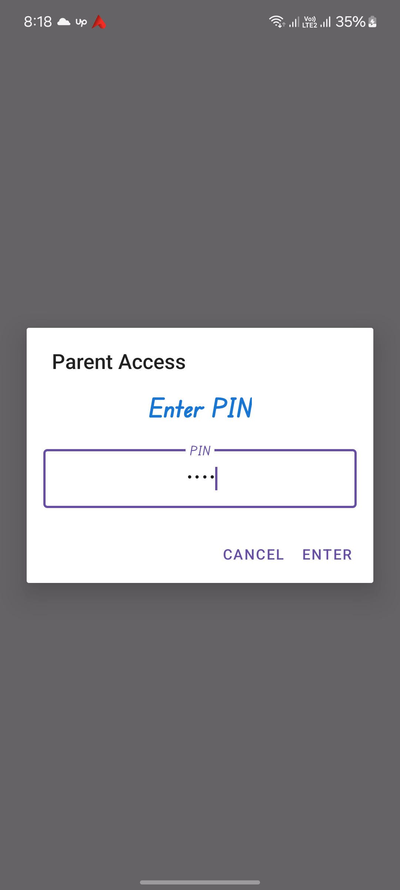
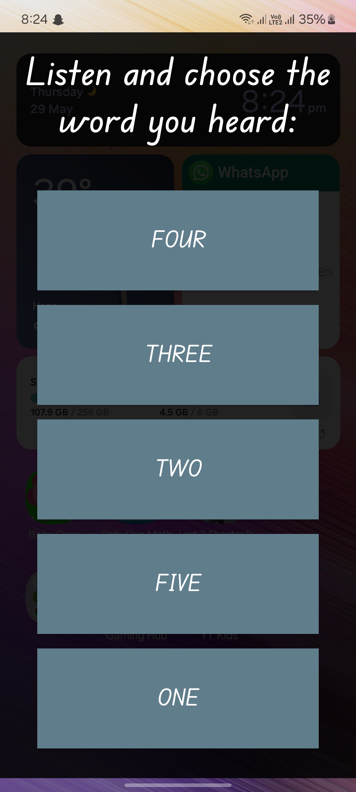

Android App (Learn more words to read)
Help children Learn New Words.
Description :
. Appear as overlay every X minutes (default: 5 mins)
2. Play recorded audio of a word
3. Show 5 large text buttons with words (1 correct + 4 random)
4. Close immediately on correct selection (green ✅)
5. Show red ❌ + play fail sound on incorrect (replay after 3 fails)

**Parent Features (PIN-protected):**
- Add/edit/delete words
- Record audio directly in app (stores locally)
- Set interruption intervals (5/10/30 mins)
- Set active days (e.g. weekdays only)

**Technical Requirements:**
- Kotlin (min API 21)
- 100% local storage - no internet/APIs
- Room Database for words
- SharedPreferences for settings
- Local MP3 audio files
- SYSTEM_ALERT_WINDOW permission
- AlarmManager for scheduling
- MediaRecorder/MediaPlayer for audio

